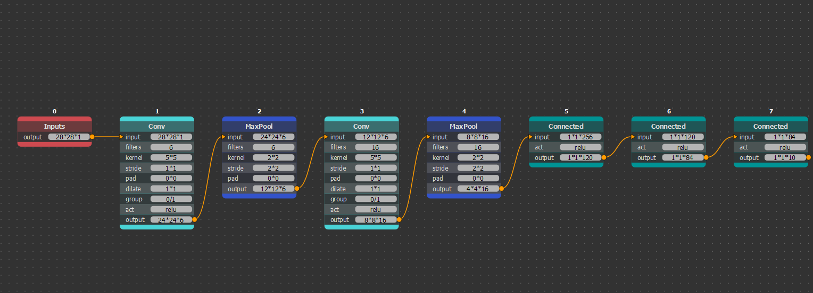

# Msnhnet

---

###  A pytorch inference framework which inspired from darknet.


**TODO:**
1.GPU</br>
2.neon</br>

**OS supported**

| |windows|linux|mac|
|---|---|---|---|
|checked|<center>√</center>|<center>√</center>|<center>√</center>|
|gpu|<center>x</center>|<center>x</center>|<center>x</center>|

**Requirements**
  * OpenCV4 https://github.com/opencv/opencv
  * yaml-cpp https://github.com/jbeder/yaml-cpp
  * Qt5 (**optional**. for Msnhnet viewer) http://download.qt.io/archive/qt/

**How to build**
- With CMake 3.10+
- Options</br>

**ps. You can change omp threads by unchecking OMP_MAX_THREAD and modifying "num" val at CMakeLists.txt:43** </br>

- Windows
1. Compile opencv4 and yaml-cpp.
2. Config environment. Add "OpenCV_DIR" and "yaml-cpp_DIR" 
3. Get qt5 and install. http://download.qt.io/ **(optional)**
4. Then use cmake-gui tool and visual studio to make or use vcpkg.

- Linux(Ubuntu)
```
sudo apt-get install qt5-default      #optional
sudo apt-get install libqt5svg5-dev   #optional
sudo apt-get install libopencv-dev

git clone https://github.com/jbeder/yaml-cpp.git
cd yaml-cpp
mdir build 
cd build 
cmake ..
make -j4
sudo make install 

sudo echo /usr/local/lib > /etc/ld.so.conf/usrlib.conf

vim ~/.bashrc

```